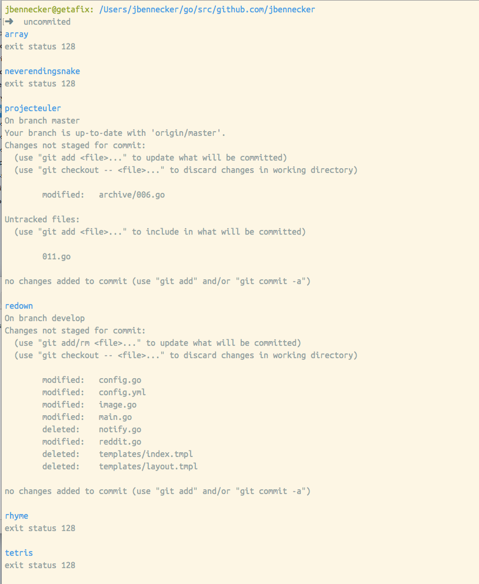

# uncommitted

lists git repositories not in sync with remote

### usage

    $ uncommited

### example output

### install

You can download the [prebuilt binary](https://github.com/jbennecker/uncommitted/raw/master/uncommited) or install with go

    $ go get github.com/jbennecker/uncommitted
